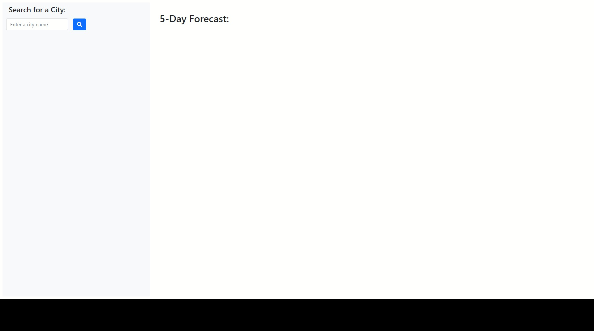
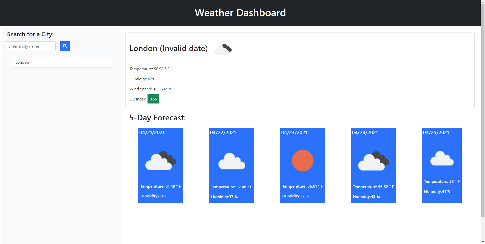
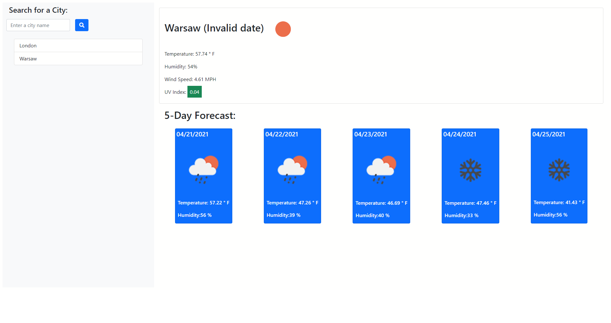

# Weather Dashboard

## Project Link

Click [here](https://iwanagahime.github.io/Weather-Dashboard/.) to view project on GitHub pages.

## Description

We were asked to retrieve data from another application's API and use it in the context of our own application. Our challenge was to build a weather dashboard that runs in the browser and features dynamically updated HTML and CSS.

## What did we do?

- We created a weather outlook for multiple cities
- We built a weather dashboard with form inputs
  Our form inputs allow searching for a city and return current and future conditions for that city
- Our searched city is added to the search history
- We dynamically created a card containing such data as city name, the date, an icon representation of weather conditions, the temperature, the humidity, the wind speed, and the UV index that allows viewing current weather conditions for a given city
- Our UV index data is presented using color that indicates whether the conditions are favorable, moderate, or severe
- We dynamically constructed future weather conditions cards for that city that presented a 5-day forecast with displayed date, icon representation of weather conditions, temperature, and humidity
- in the search history is constructed in such a way that when a city is clicked, current and future weather conditions cards are being displayed
- We used the [OpenWeather API](https://openweathermap.org/api) to retrieve weather data for cities.
- Formatted code using prettier

## Getting started

- Clone the GitHub project onto your local machine
- Navigate into the project
- Open the project in VSCode
- Open the `script.js` file in your default browser

```
git clone https://iwanagahime.github.io/Weather-Dashboard/.
code .
```

## Screenshots

###



###



###




